# 1. Requirements Overview
## 1.1 What is OWLS - Operating with Lecturers & Students?
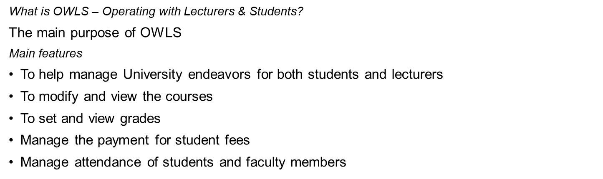
## 1.2 Stakeholder
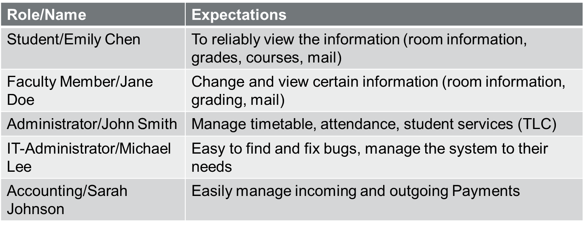
## 1.3 Quality Goals
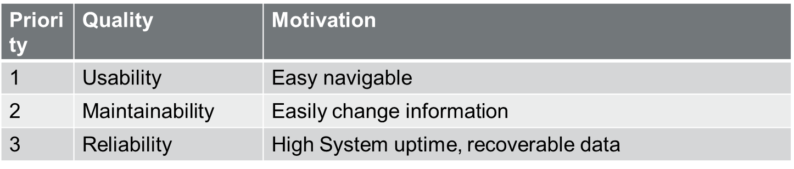

# 2. Solutions, Decisions and Risks
## 2.1 Solution Strategy
Recognizing difficulties and finding solutions for our goals.
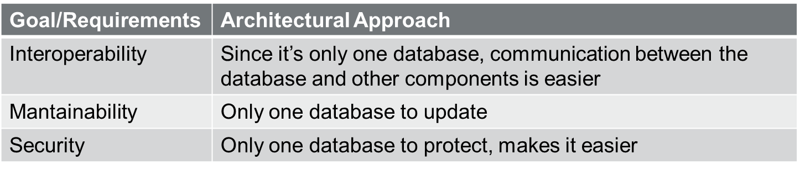
## 2.2 Architecture Decisions
Looking at architecture from different angles to get more viewpoints and decide on a proper solution.
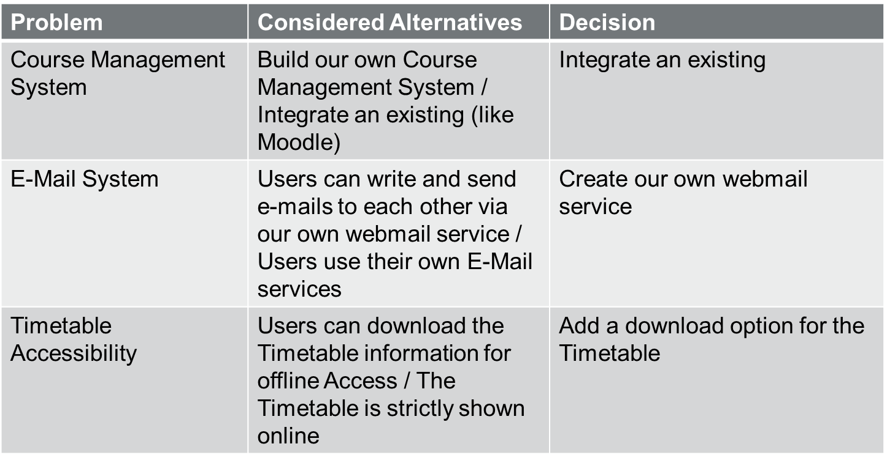
## 2.3 Risks and Technical Debt
Recognizing risks with our architectural decision and suggesting measures to minimize the the technical debt.
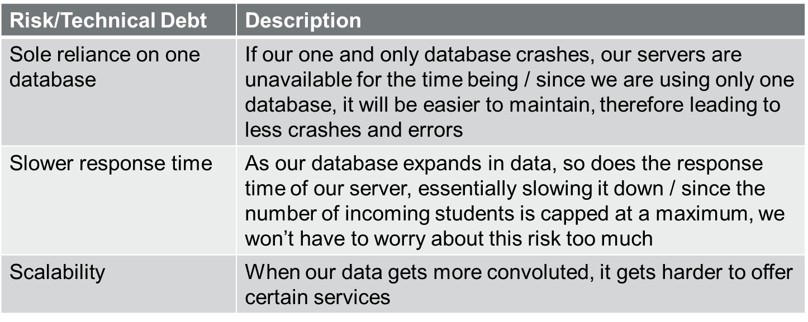

# 3. Architecture Constraints
## 3.1 Architecture Constraints
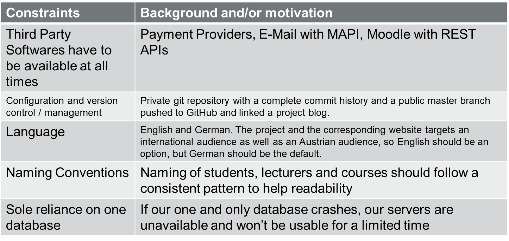
## 3.2 Business Context
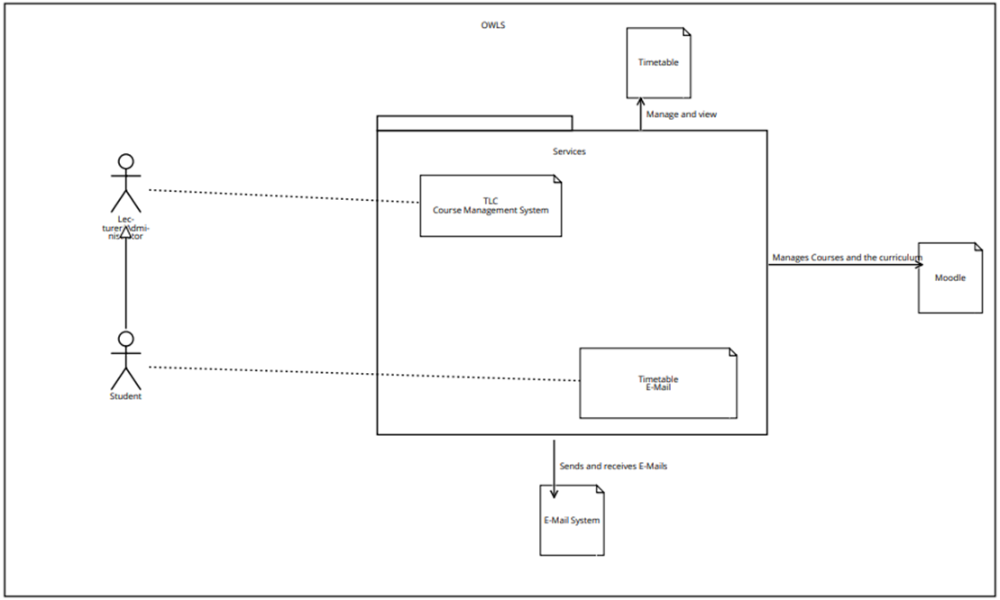

# 4. Crosscutting Concepts
## 4.1 Crosscutting Concepts
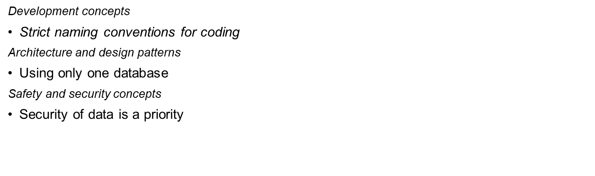
## 4.2 Decisions
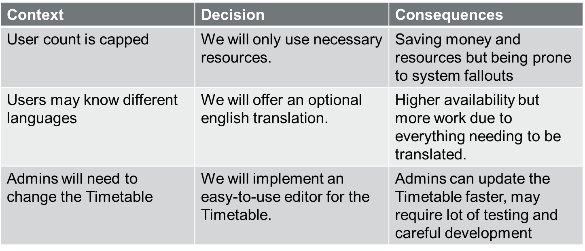

# 5. Quality
## 5.1 Quality Goals and Scenarios
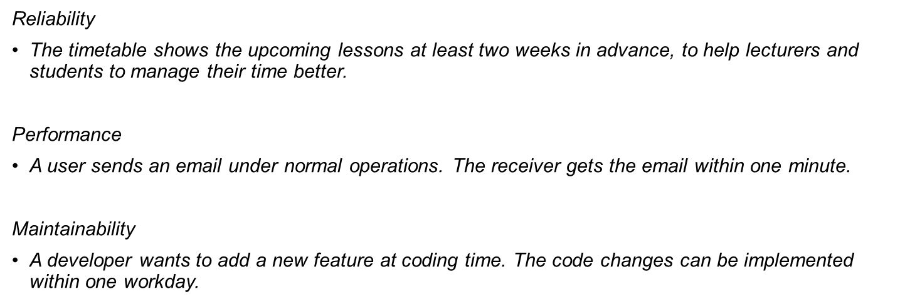
## 5.2 Quality Tree
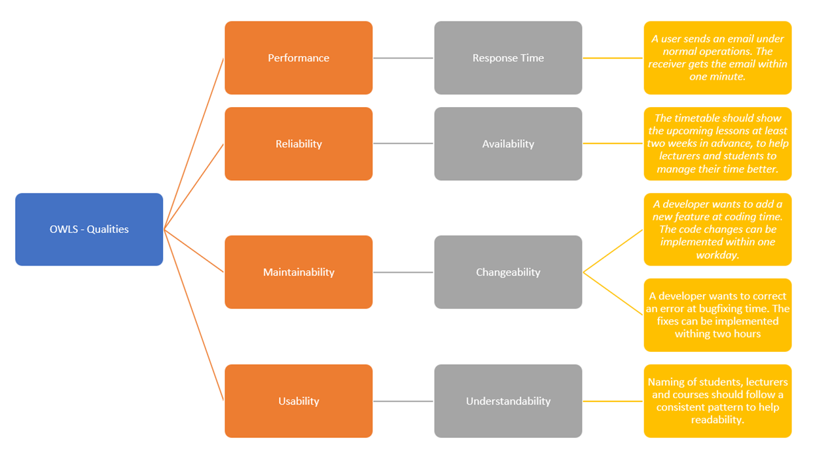

# 6. Building Block View
## 6.1 Level 1
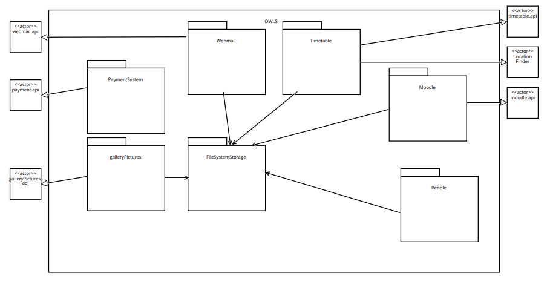
## 6.2 Level 2
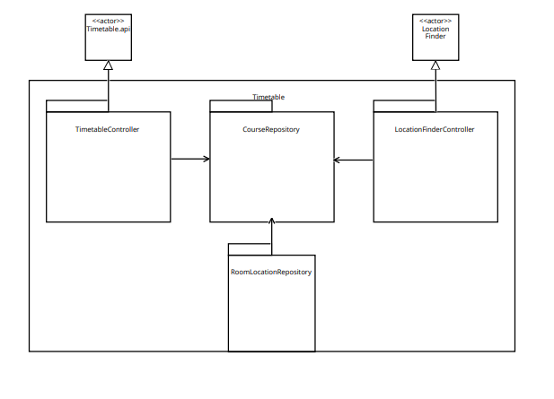

# 7. Runtime View
## 7.1 Lektor krank
Lektor meldet sich krank beim Systemadministrator, der Timetable muss angepasst werden.
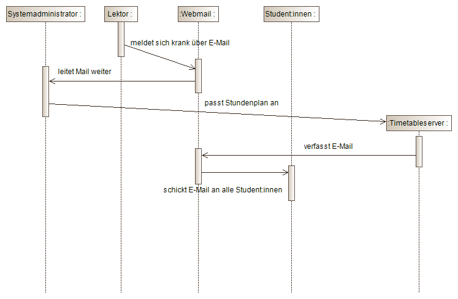
## 7.2 Harald zahlt
Ein neues Studiensemester beginnt, Harald, ein Student, muss seine Studiengebühren für das kommende Semester bezahlen.
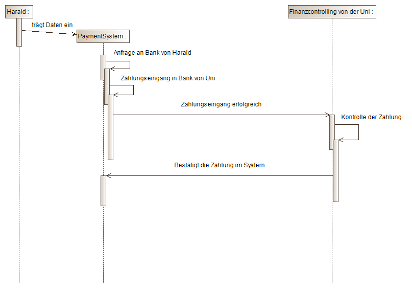

# 8. Deployment View
## 8.1 CAP-Theorem
Ein CP System ist für OWLS am Besten geeignet.  
<strong>Consistency</strong> verfügbar ist in allen Systemen. Wenn ein Lektor sich krankmeldet und der Systemadmin den Stundenplan anpasst, wird dieser sofort für alle Nutzer aktualisiert. Ebenso passiert dies bei Website Anpassungen. Für eine bessere <strong>Consistency</strong> wird ein to-face-commit implementiert um beispielsweise die Noten der Studenten fehlerfrei anzeigen zu lassen.  
Ebenso wichtig für uns ist <strong>Partitioning</strong>, da unser System nach einem Netzwerkausfall nicht weiterarbeiten kann und <strong>Partitioning</strong> zwingend notwendig ist für einen two-face-commit. 
<strong>Availability</strong> ist weniger wichtig, da bei Ausfall des Clients eine Datenpräservation nicht von besonders hoher Importanz ist. Wie in 5.2 erwähnt, brauchen wir für Updates unseres Systems einen gewissen Platz zum Atmen um diese vollständig zu implementieren. Hierfür würde allerdings das System für einige Zeit unverfügbar sein, was allerdings kein Problem sein sollte. OWLS wird bereitgestellt für Universitäten mit rund 5.000 Schülern von denen sich der Großteil in derselben Zeitzone befindet. 
## 8.2 Deployment Diagram
